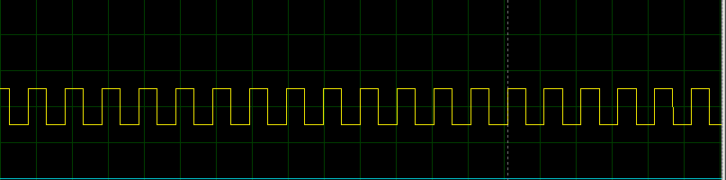

# Fan Control Sys

## Overview
This project is a fan control system that adjusts the speed of a DC motor based on the temperature readings from an LM35 temperature sensor.
The system utilizes an ATmega32 microcontroller and implements both Hardware Abstraction Layer (HAL) and Microcontroller Abstraction Layer (MCAL) approaches for efficient and modular programming.

## Components Used
- ATmega32 microcontroller
- LM35 temperature sensor
- DC motor
- L293D motor driver
- LCD screen for temperature display

## Functionality
The fan control system operates by continuously monitoring the temperature using the LM35 sensor.
Based on the temperature readings, it adjusts the speed of the DC motor to control the cooling effect. The higher the temperature, the faster the fan motor spins.

To achieve this functionality, the project is divided into two main approaches: HAL and MCAL.

### HAL (Hardware Abstraction Layer)
The HAL approach involves building drivers for various components to abstract the low-level hardware details and provide a higher-level interface for the application. The following drivers are implemented:

- **LCD Driver**: This driver allows for displaying the current temperature on the LCD screen. It provides functions to initialize the LCD, write data to the screen, and handle other display-related operations.
- **LM35 Driver**: The LM35 driver provides functions to interface with the LM35 temperature sensor. It reads the analog signal from the sensor and converts it to a digital value for temperature calculation.
- **Motor Driver**: The motor driver controls the DC motor's speed using the L293D motor driver. It receives the desired speed as input and generates the appropriate PWM signals to adjust the motor's speed accordingly.

### MCAL (Microcontroller Abstraction Layer)
The MCAL approach involves building low-level drivers to directly interface with the microcontroller's hardware peripherals. The following drivers are implemented:

- **GPIO Driver**: The GPIO driver handles the control of inputs and outputs of the microcontroller. It provides functions to configure pins as inputs or outputs and control their states.
- **ADC Driver**: The ADC (Analog-to-Digital Converter) driver enables the conversion of analog signals from the LM35 temperature sensor to digital values that can be processed by the microcontroller.
- **PWM Driver**: The PWM driver generates analog values using Pulse Width Modulation to control the speed of the DC motor. It provides functions to configure PWM channels, set duty cycles, and manage the motor's speed.

## Usage
To use the fan control system, follow these steps:

1. Connect the LM35 temperature sensor to the appropriate pins of the microcontroller.
2. Connect the DC motor to the L293D motor driver, ensuring the correct wiring.
3. Connect the LCD screen to the microcontroller for temperature display.
4. Compile and upload the firmware to the ATmega32 microcontroller.
5. Power on the system.

The system will start reading temperature values and display them on the LCD screen. The fan motor speed will automatically adjust based on the detected temperature, providing an efficient cooling mechanism.

## Screenshots

## Conclusion
The fan control system with temperature sensing provides an effective way to regulate cooling by adjusting the fan motor speed based on the detected temperature. By using the HAL and MCAL approaches, the project achieves modular and maintainable code, allowing for easy expansion and customization. With potential future improvements, this system can be further enhanced to meet specific requirements and provide a comprehensive cooling solution.

### Contributions
Contributions are welcome! If you have any suggestions, bug reports, or feature requests, please open an issue or submit a pull request on the project's GitHub repository.

